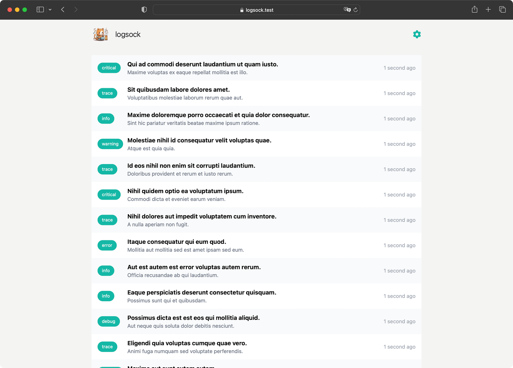

# logsock


A really simple web app to log stuff and send notifications. 
It uses the [Web Push API](https://developer.mozilla.org/en-US/docs/Web/API/Push_API) to send notifications to your phone or desktop browser.

Example use cases:

- Notify yourself after a long running task has finished
- Receive alerts from monitoring tools



## Setup

- Generate a VAPID keypair

```

# using the web-push nodejs package
npx web-push generate-vapid-keys

# using openssl
openssl ecparam -name prime256v1 -genkey -noout -out vapid_private_key.pem
openssl ec -in vapid_private_key.pem -pubout -out vapid_public_key.pem
echo -n VAPID_PRIVATE_KEY=;cat vapid_private_key.pem | sed -e "1 d" -e "$ d" | tr -d "\n"; echo
echo -n VAPID_PUBLIC_KEY=;cat vapid_public_key.pem | sed -e "1 d" -e "$ d" | tr -d "\n"; echo


```

- Use a docker-compose file like the following:

```
---
version: '3'
services:
  logsock:
    image: ghcr.io/pwaldhauer/logsock:latest
    ports:
      - "127.0.0.1:9901:9901"
    environment:
      - TRUST_PROXIES="*"
      - APP_URL="https://logsock.example.com"
      - VAPID_SUBJECT="mailto:foo@example.com"
      - VAPID_PRIVATE_KEY="xxx"
      - VAPID_PUBLIC_KEY="xxx"
    volumes:
      - logsock-data:/app/storage
    restart: always

volumes:
  logsock-data:

```

- Of course, you could also install it without docker, it should work on any PHP 8.2+ installations:

```
npm run build
composer install
cp .env.example .env

# Put your VAPID keys in the .env file

php artisan key:generate
php artisan app:init
```

- Put it behind a reverse proxy with SSL
- Create a user:


```

docker compose exec logsock php artisan app:user-create

# or, if not using docker

php artisan app:user-create

```

- Add the page to your home screen (on iOS), go to the settings (cog wheel) and click _Subscribe_ to subscribe for notifications
- On the same page, create your API token and send your first log:

```

curl "https://logsock.example.com/api/?_token=YOUR-API-TOKEN&topic=test&message=Hello%20World"

```

## License

MIT
